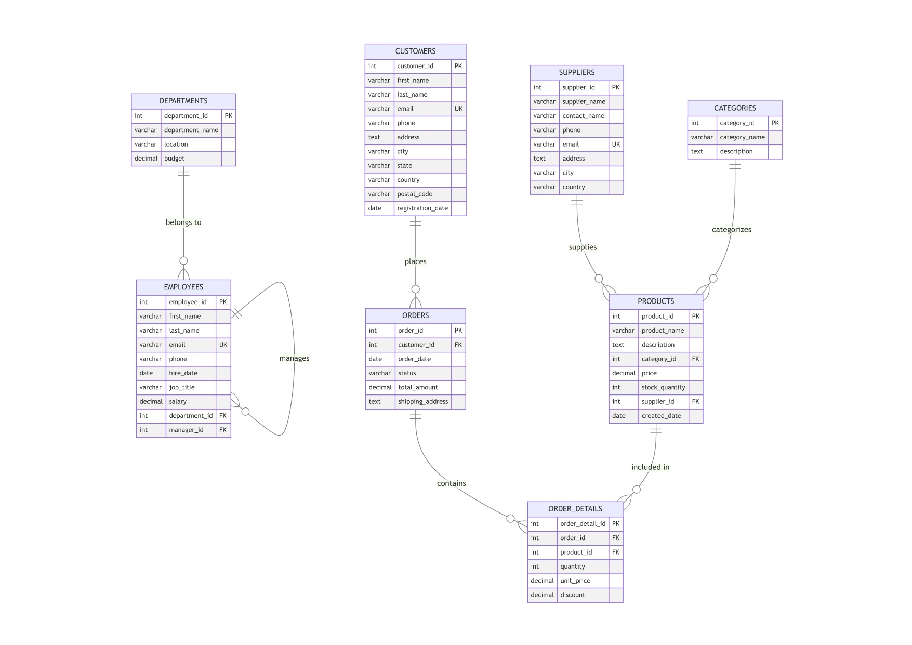

> **Status**: In Progress  
> **Purpose**: Practice advanced SQL querying and relational database design.  
> **Note**: This repository is part of my ongoing SQL learning journey. Open to contributions, feedback, and collaboration.

---

## 🧱 Entity-Relationship (ER) Diagram

<!-- Replace this with your actual ER diagram path or image -->

The ER diagram provides a visual representation of the logical structure of the database and the relationships between entities involved in the e-commerce system.

---

## 🗃️ Database Schema Overview

The database schema models an end-to-end e-commerce platform with the following tables:

| Table           | Description                                                             |
|----------------|-------------------------------------------------------------------------|
| `departments`  | Company departments with location and budget information                |
| `employees`     | Employee records with job roles, salaries, department IDs, and manager hierarchy   |
| `suppliers`    | Product suppliers with contact and address details                      |
| `categories`   | Product categories including name and descriptions                      |
| `products`     | Product listings with pricing, inventory, supplier, and category links  |
| `customers`    | Customer profiles with contact and location information                 |
| `orders`       | Customer order headers with status and shipping data                    |
| `order_details`| Line items for each order including quantity, product, and unit price   |

---

## 🔗 Entity Relationships Overview

| Relationship                  | Type         | Description                                          |
|------------------------------|--------------|------------------------------------------------------|
| `departments` → `employees`  | One-to-Many  | Each department can have multiple employees.         |
| `employees` → `employees`    | One-to-Many  | One employee can manage multiple others. *(Self-referencing)*|
| `suppliers` → `products`     | One-to-Many  | One supplier can supply many products.               |
| `categories` → `products`    | One-to-Many  | A category may contain multiple products.            |
| `customers` → `orders`       | One-to-Many  | Each customer may place multiple orders.             |
| `orders` → `order_details`   | One-to-Many  | Each order contains multiple product line items.     |
| `products` → `order_details` | One-to-Many  | A product may appear in multiple orders.             |

---

## 🔐 Key Database Concepts

| Concept                    | Description                                   | Example                                     |
|---------------------------|-----------------------------------------------|---------------------------------------------|
| **Primary Key (PK)**       | Unique identifier for each record             | `product_id`, `order_id`                    |
| **Foreign Key (FK)**       | Links to the PK of another table              | `customer_id` in `orders` → `customers`     |
| **Unique Constraint (UK)** | Prevents duplicate values in a column         | Unique email in `customers`                 |

---

## 🔑 Keys & Constraints Summary

| Table         | Primary Key     | Foreign Keys                                   |
|---------------|------------------|-----------------------------------------------|
| departments   | department_id    | –                                             |
| employees     | employee_id      | department_id → departments, manager_id → employees |
| products      | product_id       | supplier_id → suppliers, category_id → categories |
| orders        | order_id         | customer_id → customers                       |
| order_details | (order_id, product_id) | product_id → products, order_id → orders |

---

## 📬 Contributing & Feedback

You're encouraged to contribute in any of the following ways:

### ✅ Schema Enhancements
- Suggest new tables such as `payments`, `reviews`, `returns`, `delivery_tracking`
- Propose normalization improvements or indexing strategies

### ✅ Query Contributions
- Submit optimized SQL queries for reporting, analytics, or data mining
- Add use-case based queries (e.g., customer retention, category-wise performance)

### ✅ Feature Add-ons
- Recommend additional modules like:
  - 📦 Inventory restocking logic  
  - 📍 Location-based supplier filtering  
  - 🎟️ Coupon/discount engine  
  - 👤 Admin/user role systems  

### ✅ Open Issues or Ask Questions
- Found a bug? Have a suggestion? Open an issue!
- Have SQL doubts or need clarification? Feel free to ask!

> 💬 **Want to practice a specific type of query or scenario?**  

> Suggest it under issues or discussions and it may be included in future updates.

---

## 🙌 Acknowledgments

Special thanks to the open-source SQL and data community for resources, feedback, and inspiration.  

---